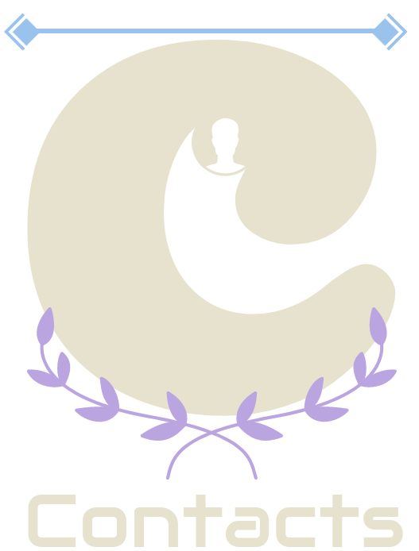
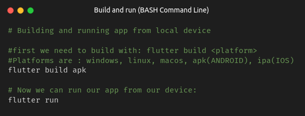
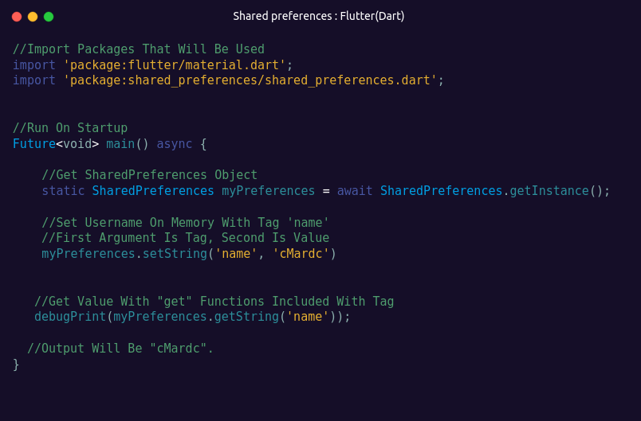
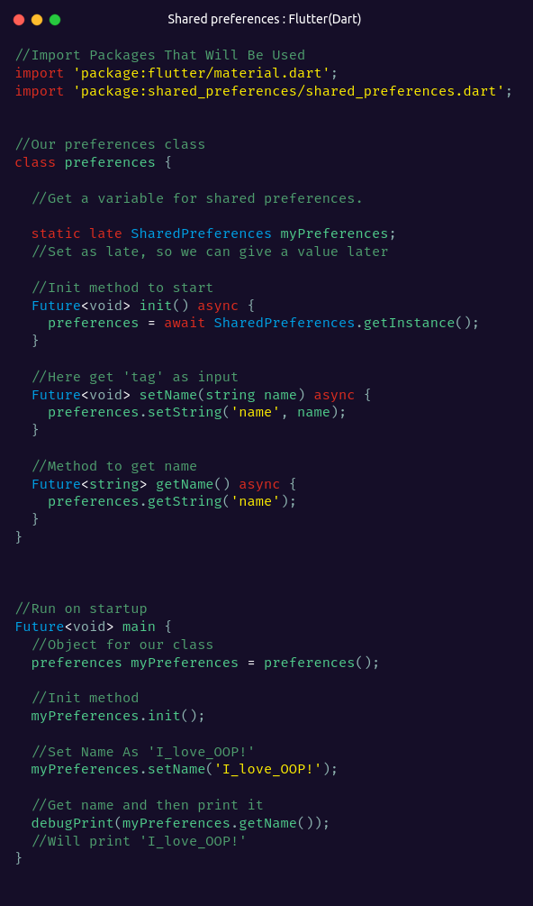

-blue)

<h3>A very basic mobile app that made with flutter.</h3>

<h2>Installation</h2>

<h3>You can easily download .apk file from our webpage.</h3>
<a href="https://cmardc.github.io/contactsApp/">Download page</a>

<h2>Build And Run</h2>

<h2>Features</h2>
<ul>
<li>It's an app that allows you to save your contacts and their numbers.</li>
<li>You can edit names and numbers in your contact list.</li>
<li>Your data is securely stored within the app.</li>
<li>The app efficiently manages and stores your data with almost no limits.</li>
<li>The app is coded in Flutter, with every error fixed.</li>
<li>It does not connect to any external database or network.</li>
<li>It saves your data on your own device</li>

<h2>Screenshots</h2>

<h2>How it works</h2>
<h4>As we discussed before, this app saves user data on their local device. The data app stores are list of contacts and background color.</h4>
<h4>This is made with <a href="https://pub.dev/packages/shared_preferences">shared preferences package</a>. This package allows developers to store data in local device.</h4>
<h4>Let's look at an example here: </h4>

<h4>But it's always better to make code better. Let's create a class that will handle these for us: </h4>

<h4>Made by ~cM</h4>
<h5>Other links : </h5>
<a href="https://discord.gg/5W4XtHkc6g">Discord</a>

