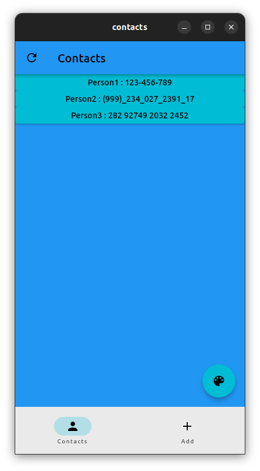
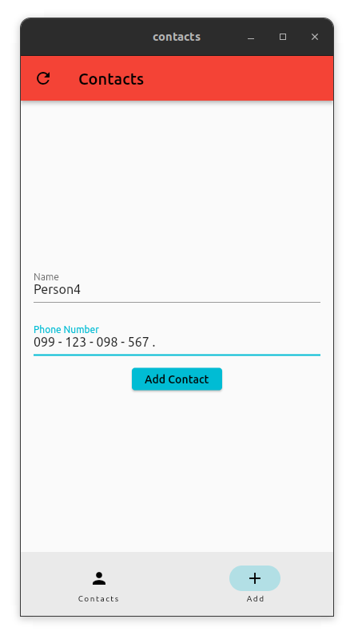
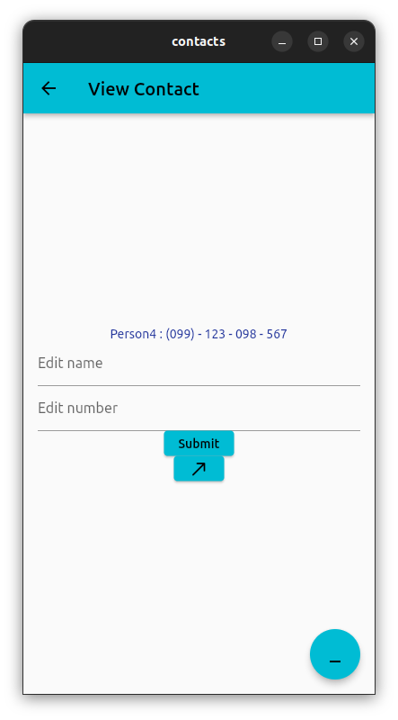
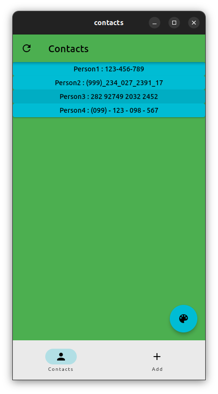

# Contacts

<h2>A Very Basic Mobile App That Made With Flutter.</h2>
<a href="https://cmardc.github.io/contactsApp/">Installation page</a>
<h3>APK File Is Located At : <pre>build/app/outputs/flutter-apk/app-release.apk</pre></h3>

<h3>Android build:  <pre>$ flutter build apk</pre></h3>
<h3>IOS build:      <pre>$ flutter build ipa</pre></h3>
<h3>Linux build:    <pre>$ flutter build linux</pre></h3>
<h3>Windows build:  <pre>$ flutter build windows</pre></h3>
<h3>MacOS build:    <pre>$ flutter build macos</pre></h3>
<h3>Web build:      <pre>$ flutter build web</pre></h3>

<h3>Screenshots: </h3>
<!--

-->

<h3>Made by ~cM</h3>
<a href="https://discord.gg/5W4XtHkc6g">Discord</a>
<a href="https://github.com/cMardc">Github</a>

